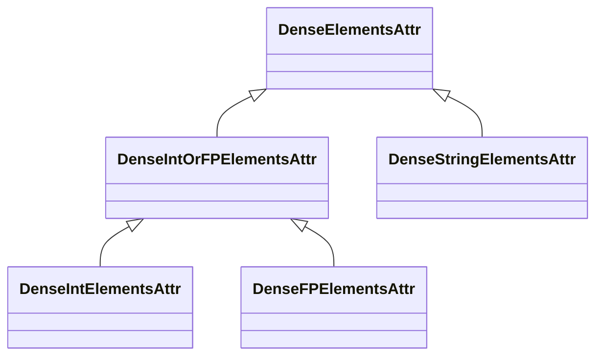
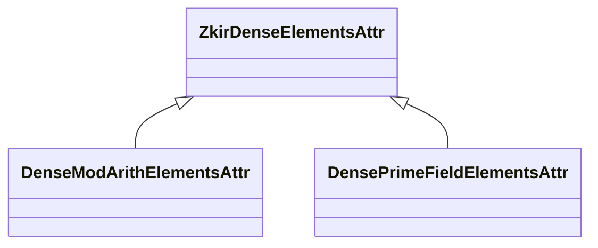
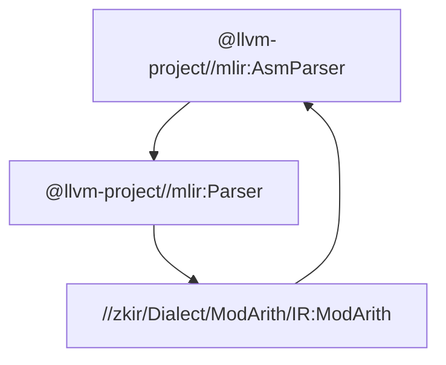

# ZKIR Builtin Attributes: `ZkirDenseElementsAttr`

## Motivation

Existing **MLIR Builtin Attributes** impose restrictions that are unsuitable for
representing dense, multi-dimensional data involving ZKIR's cryptographic
primitive types (e.g., prime field elements).

The standard `mlir::DenseElementsAttr` is constrained to element types that are
either integer, floating-point, complex number, or string attributes. Violating
this constraint can lead to crashes.



The historical dependency on `DenseElementsAttr` for parsing literal values
forced the use of an awkward and unnatural syntax for our operations, as seen
with `mod_arith.constant`:

```mlir
%0 = mod_arith.constant dense<[10, 11]> : tensor<2xi32> : tensor<2x!mod_arith.int<65537 : i32>>
```

This necessity arose because we relied on `DenseElementsAttr` to handle the
parsing of the `dense<[...]>` literal.

## Introducing `ZkirDenseElementsAttr`

To address this, we introduce the **`ZkirDenseElementsAttr`** hierarchy, a new
class specifically designed to represent dense elements of **cryptographic
primitive types** within ZKIR.

### Hierarchy and Structure

The structure mirrors the MLIR builtin attribute hierarchy:



- **`mlir::zkir::ZkirDenseElementsAttr`**: The base class, analogous to
  `mlir::DenseElementsAttr`. It provides the common interface for ZKIR dense
  element attributes.
- **`mlir::zkir::mod_arith::DenseModArithElementsAttr`**: A concrete subclass,
  analogous to `mlir::DenseIntElementsAttr` or `mlir::DenseFloatElementsAttr`.
  It is used specifically for dense arrays of `mod_arith` types.

### Minimal Dependency Design

Unlike the original `DenseElementsAttr`, `ZkirDenseElementsAttr` must depend on
types defined in various ZKIR dialects (e.g., `mod_arith::ModArithType`). To
prevent circular dependencies:



- **`ZkirDenseElementsAttr`** is designed to have **minimal dependencies** in
  `zkir/IR/Attributes.h`.
- Crucial, dialect-specific **iterator utilities** (e.g., `getValues<T>()`) have
  been moved to the concrete dialect-level subclasses (like
  `DenseModArithElementsAttr`) because they require knowledge of the specific
  dialect's types and storage format.

### Improved Syntax and UX

With `ZkirDenseElementsAttr` now handling the parsing of dense literals, the
`mod_arith.constant` operation can adopt a much cleaner syntax:

```mlir
%0 = mod_arith.constant dense<[10, 11]> : tensor<2x!mod_arith.int<65537 : i32>>
```

### Conversion and Lowering

The introduction of this attribute enables a clear lowering path:

1. **Parsing/Representation**: The `mod_arith.constant` operation now holds an
   **`IntegerAttr`** (for scalar constants) or a
   **`mod_arith::DenseModArithElementsAttr`** (for dense arrays) as its value.
1. **Lowering**: During conversion passes (e.g., `ModArithToArith`), an
   operation with a `mod_arith::DenseModArithElementsAttr` will be seamlessly
   lowered to an `arith.constant` operation holding a standard
   **`mlir::DenseIntElementsAttr`**.

The `ZkirDenseElementsAttr` provides the necessary abstraction to integrate
ZKIR's custom types into the MLIR attribute system while maintaining
compatibility and a clean user experience.
